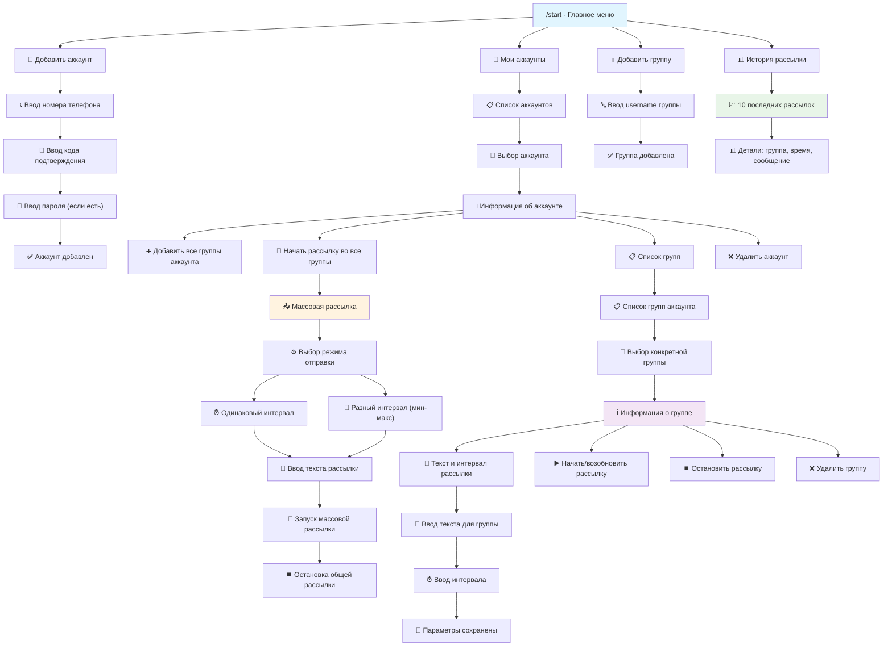

📌 Бот для рассылки сообщений
---

## Это бот для рассылки массовых сообщений в телеграмме

---
## 🚀 Возможности

- Добавление аккаунтов Telegram
- Управление группами для рассылки
- Массовая рассылка с настраиваемыми интервалами
- Одиночная рассылка в выбранные группы
- История всех рассылок
- Отправка сообщений в приватные группы

## 📊 Схема работы бота


---
## Стек

- **Python** 3.10+
- **Telethon**
- python-decouple
- SQLite3

---
## 📦 Установка и Запуск
1. Установите зависимости через консоль:
   ```bash
   pip install -r requirements.txt
   ```
2. Получите API_ID и API_HASH на сайте телеграмма
3. Получите токен бота у @BotFather 
4. Получите id вашего(-их) аккаунтов в телеграмм
5. Настройте конфиг:
   Заполните `.env`:
   ```dotenv
    API_ID='Ваш API_ID'
    API_HASH='Ваш API_HASH'
    BOT_TOKEN='Ваш токен бота'
    ADMIN_ID_LIST= # <-- Вставить ID разрешенных телеграмм аккаунтов через запятую
    # Остальные параметры...
   ```
6. Получите id вашего(-их) аккаунтов в телеграмм
7. 🖥 Запустите файл main.py через интерфейс **IDE** или через консоль:
   ```bash
   python main.py
   ```
---
# 📱 Работа с ботом

## 👤 Управление аккаунтами

### ➕ Добавление аккаунта
1. Запустите бота командой `/start`
2. Выберите **"👤 Добавить аккаунт"**
3. Введите номер телефона аккаунта Telegram в международном формате (например: +79001234567)
4. Введите код подтверждения, который придет в Telegram
5. Если на аккаунте установлена двухфакторная аутентификация, введите пароль
6. ✅ Аккаунт успешно добавлен в систему

### 📊 Просмотр аккаунтов
1. В главном меню выберите **"📱 Мои аккаунты"**
2. Отобразится список всех добавленных аккаунтов
3. Выберите нужный аккаунт для просмотра детальной информации
4. В информации об аккаунте вы увидите:
   - Данные пользователя
   - Количество групп
   - Статус рассылок
   - Доступные действия

### ❌ Удаление аккаунта
1. Перейдите в **"📱 Мои аккаунты"**
2. Выберите аккаунт, который хотите удалить
3. Нажмите **"❌ Удалить аккаунт"**
4. Подтвердите удаление, введя номер телефона аккаунта
5. ⚠️ Все данные аккаунта и его групп будут удалены

---

## 📋 Управление группами

### ➕ Добавление отдельной группы
1. В главном меню выберите **"➕ Добавить группу"**
2. Введите **username** группы или канала (например: @mygroup или @mychannel)
3. ✅ Группа будет добавлена в базу данных для рассылок

### 📥 Добавление всех групп аккаунта
1. Перейдите в **"📱 Мои аккаунты"**
2. Выберите нужный аккаунт
3. Нажмите **"➕ Добавить все группы аккаунта"**
4. Система автоматически найдет и добавит все группы, где состоит данный аккаунт
5. ✅ Все доступные группы добавлены

### 📊 Просмотр групп аккаунта
1. В разделе **"📱 Мои аккаунты"** выберите аккаунт
2. В информации об аккаунте будет показан общий список групп
3. Вы увидите статус каждой группы (активна рассылка или нет)

### 🔍 Детальная информация о группе
1. Выберите аккаунт в разделе **"📱 Мои аккаунты"**
2. Нажмите **"📋 Список групп"**
3. Выберите интересующую группу из списка
4. Отобразится подробная информация:
   - Название группы
   - Текущий текст рассылки
   - Установленный интервал
   - Статус рассылки (активна/неактивна)
   - Доступные действия для группы

---

## 📤 Массовая рассылка

### 🚀 Запуск массовой рассылки
1. Перейдите в **"📱 Мои аккаунты"** и выберите нужный аккаунт
2. Нажмите **"🚀 Начать рассылку во все группы"**
3. Выберите режим отправки:
   - **⏰ Одинаковый интервал** - одинаковое время между отправками во все группы
   - **🎲 Разный интервал** - случайный интервал в заданном диапазоне (мин-макс)
4. Введите текст сообщения для рассылки
5. Настройте интервалы:
   - **Для одинакового интервала**: введите время в секундах (например: 60)
   - **Для разного интервала**: сначала минимальное значение, затем максимальное (например: 30, потом 120)
6. ✅ Массовая рассылка запустится автоматически во все группы аккаунта

### ⏹️ Остановка массовой рассылки
1. Перейдите к информации об аккаунте с активной рассылкой
2. В интерфейсе будут показаны:
   - Параметры текущей рассылки
   - Активность по группам
   - Прогресс выполнения
3. Нажмите **"⏹️ Остановить общую рассылку"**
4. ✅ Все активные рассылки данного аккаунта будут остановлены

### 📊 Мониторинг статуса рассылки
1. В информации об аккаунте отображается:
   - Общий статус рассылки (активна/неактивна)
   - Количество отправленных сообщений
   - Время последней отправки
2. В списке групп для каждой группы показывается:
   - Статус рассылки в конкретную группу
   - Время последней отправки
   - Настроенный интервал
3. В детальной информации о группе можно увидеть полную статистику

---

## 🎯 Одиночная рассылка

### ▶️ Запуск рассылки в конкретную группу
1. Перейдите в **"📱 Мои аккаунты"** и выберите нужный аккаунт
2. Нажмите **"📋 Список групп"**
3. Выберите конкретную группу для настройки рассылки
4. В информации о группе нажмите **"📝 Текст и интервал рассылки"**
5. Введите текст сообщения для данной группы
6. Установите интервал между сообщениями (в секундах)
7. Вернитесь в меню группы и нажмите **"▶️ Начать/возобновить рассылку"**
8. ✅ Рассылка в выбранную группу активирована

### ⏹️ Остановка рассылки для группы
1. Перейдите к списку групп нужного аккаунта
2. Выберите группу с активной рассылкой
3. В меню группы нажмите **"⏹️ Остановить рассылку"**
4. ✅ Рассылка для данной группы остановлена (остальные группы продолжат работать)

### ⚙️ Изменение параметров рассылки
1. Выберите группу в списке групп аккаунта
2. Перейдите в **"📝 Текст и интервал рассылки"**
3. Измените текст сообщения и/или интервал отправки
4. ✅ Новые параметры сохранены и будут использоваться в следующих сообщениях

## 📈 История рассылок

### 📊 Просмотр истории
1. В главном меню выберите **"📊 История рассылки"**
2. Отобразятся последние 10 отправленных сообщений с информацией:
   - 📍 **Группа**: название группы/канала получателя
   - ⏰ **Время**: точное время отправки сообщения
   - 💬 **Сообщение**: текст отправленного сообщения
   - 👤 **Аккаунт**: с какого аккаунта было отправлено

### 📋 Использование истории
- Отслеживание успешных отправок
- Контроль содержания сообщений
- Мониторинг времени рассылок
- Анализ активности по аккаунтам
---

# 📁 Структура проекта
```
botRasylka/
├── func/ # Дополнительные функции
│   ├── __init__.py # Точка входа модуля
│   ├── db_func.py # Функции работы с базой данных
│   ├── func.py # Общие функции бота
│   └── log_utils.py # Утилиты для логирования
├── handlers/ # Обработчики команд бота 
│   ├── __init__.py # Инициализация модуля обработчиков
│   ├── add_account_handlers.py # Добавление Telegram аккаунтов
│   ├── add_groups_handlers.py # Добавление групп для рассылки
│   ├── broadcast_all_start_handlers.py # Массовая рассылка
│   ├── broadcast_all_account_handlers.py # Управление массовыми рассылками
│   ├── broadcasts_start_handlers.py # Одиночная рассылка
│   ├── delete_account_handlers.py # Удаление аккаунтов
│   ├── delete_group_handlers.py # Удаление групп
│   ├── group_info_handlers.py # Информация о группах
│   ├── history_handlers.py # История рассылок
│   ├── my_account_handlers.py # Управление аккаунтами
│   ├── my_groups_handlers.py # Управление группами
│   └── start_handlers.py # Стартовое меню (/start)
├── logs/ # Файлы логов
├── sessions/ # Сессии Telegram аккаунтов
├── .env # Конфигурационные переменные
├── .env.example # Пример конфигурации
├── config.py # Настройки бота
├── main.py # Точка входа приложения
├── sessions.db # База данных SQLite
├── requirements.txt # Python зависимости
└── README.md # Документация проекта
```

## 🔧 Компоненты системы

- **func/** - Вспомогательные функции для работы с БД и общей логикой
- **handlers/** - Обработчики команд и состояний бота
- **logs/** - Журналы работы системы
- **sessions/** - Файлы сессий авторизованных Telegram аккаунтов
- **sessions.db** - База данных с информацией об аккаунтах и группах
